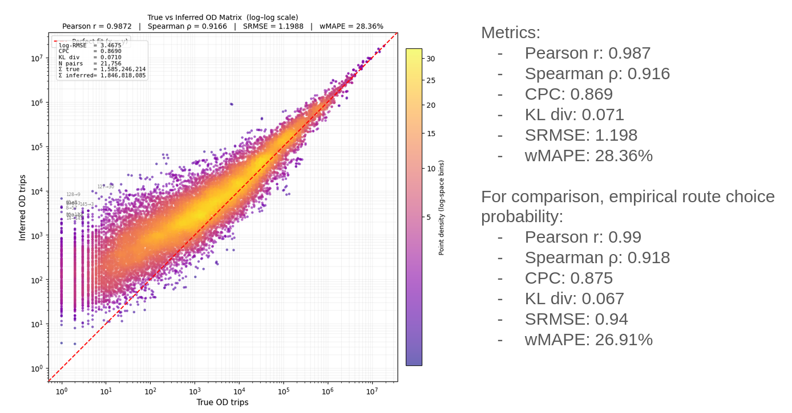
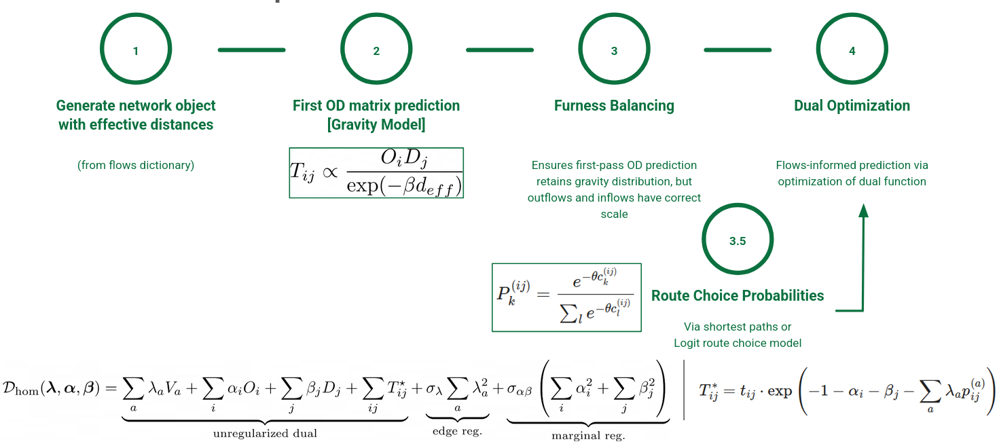

## Last time

## Reminder - The Inference Procedure

## New notation {.smaller}
:::{.left}
$$
\mathcal{L}(T,\lambda,\alpha,\beta)
= \sum_{ij}\Big[T_{ij}\ln\tfrac{T_{ij}}{T^0_{ij}} - T_{ij} + T^0_{ij}\Big] \\
+ \sum_a \lambda_a\Big(\sum_{ij}p^a_{ij}T_{ij} - V_a\Big)
+ \sum_i \alpha_i\Big(\sum_j T_{ij} - O_i\Big)
+ \sum_j \beta_j\Big(\sum_i T_{ij} - D_j\Big)
$$
:::

$$
T_{ij}^* = T^0_{ij}\,\exp\!\Big(-\sum_a p^a_{ij}\,\lambda_a - \alpha_i - \beta_j\Big)
$$

$$
\mathcal{D}(\lambda, \alpha, \beta)
= \sum_{ij} (T_{ij}^0 -  T_{ij})
+ \sum_a \lambda_a V_a
+ \sum_i \alpha_i O_i
+ \sum_j \beta_j D_j
$$

Then denote

$$
\theta = (\lambda_1, \lambda_2, ... , \alpha_1, \alpha_2, ..., \beta_1, \beta_2, ...)
$$

$$
m_{ij} = \big(p^1_{ij}, \dots, p^E_{ij},\; \underbrace{0,\dots,1,\dots,0}_{i},\; \underbrace{0,\dots,1,\dots,0}_{j}\big)
$$

So: $\log T_{ij}^* = \log T_{ij}^0 - m_{ij}^T \theta$

## Introducing a perturbation
Perturbing the flow on edge a:
$$
V_a \rightarrow V_a + \delta V_a
$$

Then the corresponding disturbance in the trip matrix will be

$$
\delta \log T_{ij} = \delta \log \tilde T_{ij}^0 - \delta m_{ij}^T \cdot \theta -  m_{ij}^T \delta \theta
$$

subject to being at new optimum:

$$
\nabla D = 0
$$

## Distance Perturbation
$$
\frac{\partial d_{a'}}{\partial V_{a'}} = - \frac{1-P_{a'}}{V_{a'}}
$$
For edges e from same origin: 
$$
\frac{\partial d_{e}}{\partial V_{e}} = \frac{P_{a'}}{V_a'}
$$

What about distances over a path? $\rightarrow$ Discontinuity

## Logit route effective distance {.smaller}

We have the logit route choice probability as

$$ 
\pi_r = \frac{e^{-\eta c_r}}{Z_{ij}}, \qquad
Z_{ij} = \sum_{s \in \mathcal{R}_{ij}} e^{-\eta c_s}, \qquad
p^a_{ij} = \sum_{r \in \mathcal{R}_{ij}} \pi_r\,[\![a \in r]\!]
$$

Then define the logit route effective distance as 

$$
d_{ij} = -\frac{1}{\eta}\ln \sum_{r \in \mathcal{R}_{ij}} e^{-\eta c_r}
$$

where for sufficiently large $\eta$, $d_{ij} \approx$ SPT effective distance.

Intuitively: this is the expected distance between the nodes for the average logit route choice traveller (?). So, slightly larger than most "efficient".

Then:

$$
\frac{\partial d_{ij}}{\partial d_b} = p_{ij}^b 
$$

## Logit route effective distance - II {.smaller}

So 

$$
\frac{\partial p_{ij}^{a}}{\partial d_b} = - \eta \operatorname{Cov}(1_a, 1_b)
$$

Then 

$$
\delta \log T_{ij} = \delta \log \tilde T_{ij}^0 - \delta m_{ij}^T \cdot \theta -  m_{ij}^T \delta \theta
$$

can be written in closed form.