

## Last time {.smaller}
 - introduced a logit all-paths effective distance
 - derived the first-order perturbation analysis of the OD matrix estimate with changes in edge flows

### since then:
 - updated inference pipeline implementation
 - processed additional datasets
 - implemented and tested perturbation analysis
 - some visualization work

## SI simulation 
<video width="640" height="480" controls>
  <source src="videos/si_comparison.mp4" type="video/mp4">
  Your browser does not support the video tag.
</video>

## SI simulation - global prevalence trajectories
::: {style="text-align: center;"}
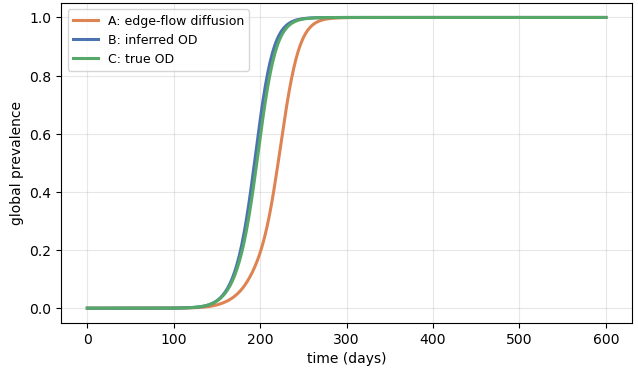{style="max-height: 650px;"}
:::

## SI simulation - arrival times
::: {style="text-align: center;"}
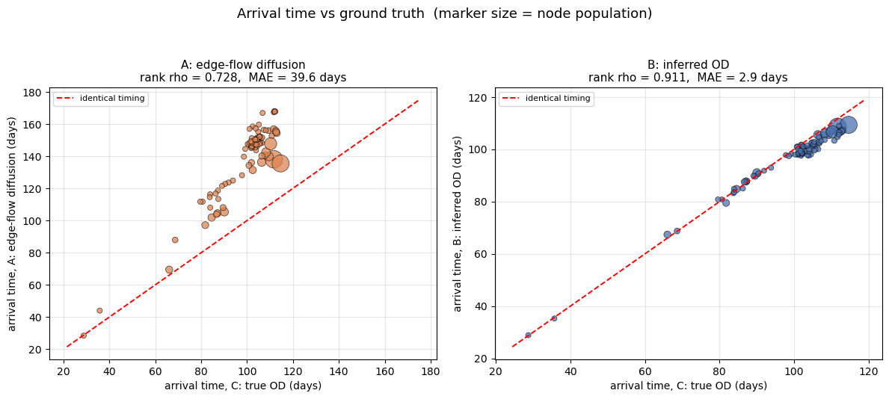{style="max-height: 550px;"}
:::

## Reminder: logit effective distance {.smaller}
We have the logit route choice probability as

$$ 
\pi_r = \frac{e^{-\eta c_r}}{Z_{ij}}, \qquad
Z_{ij} = \sum_{s \in \mathcal{R}_{ij}} e^{-\eta c_s}, \qquad
p^a_{ij} = \sum_{r \in \mathcal{R}_{ij}} \pi_r\,[\![a \in r]\!]
$$

Then define the logit route effective distance as 

$$
d_{ij} = -\frac{1}{\eta}\ln \sum_{r \in \mathcal{R}_{ij}} e^{-\eta c_r}
$$

where for sufficiently large $\eta$, $d_{ij} \approx$ SPT effective distance.

--- 

:::: {.columns}

::: {.column width="30%"}

Mean gap (shortest - logsum): 0.5218

Max gap  (shortest - logsum): 2.0444

:::

::: {.column width="70%"}
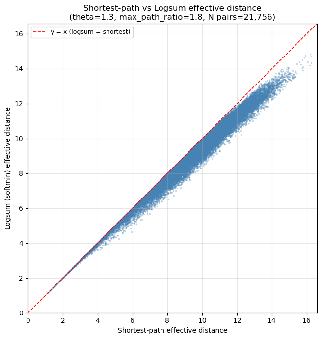
:::

::::

## Reminder - The Inference Procedure
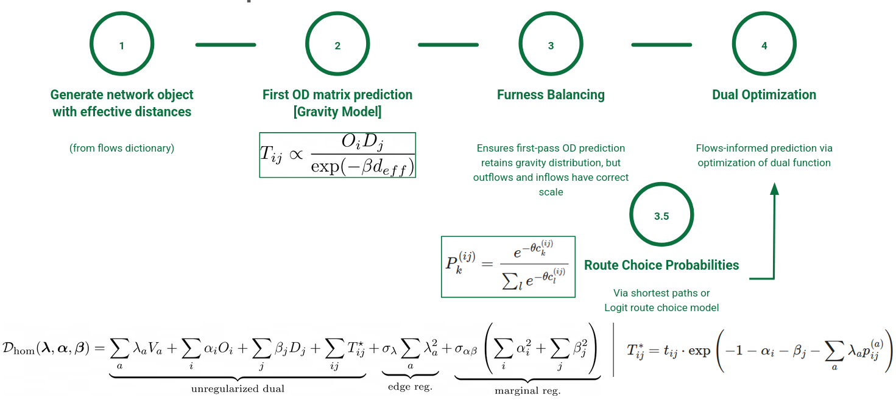

## Inference Pipeline Modifications
- using the logsum "all-paths" effective distance
- Newton post-optimization
- turning off marginal rescaling
- parameter re-calibration

## Previously: inference using SPT effective distance

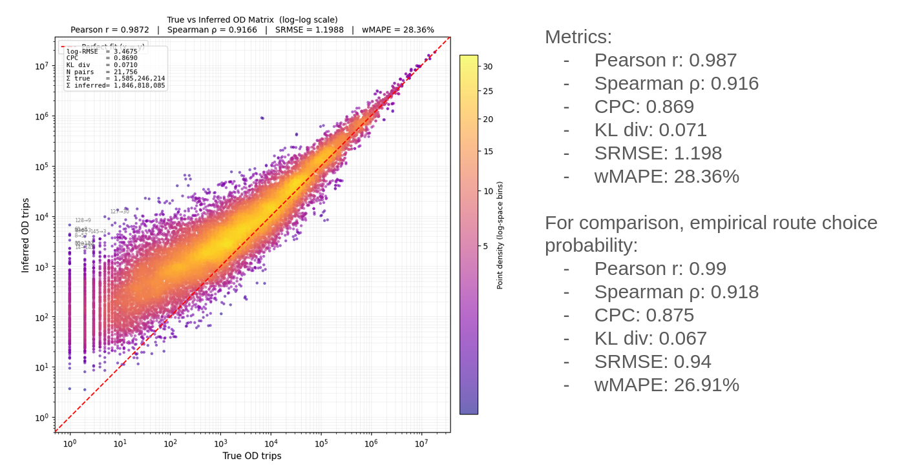

## Inference using logit paths effective distance (2019)
::: {style="text-align: center;"}
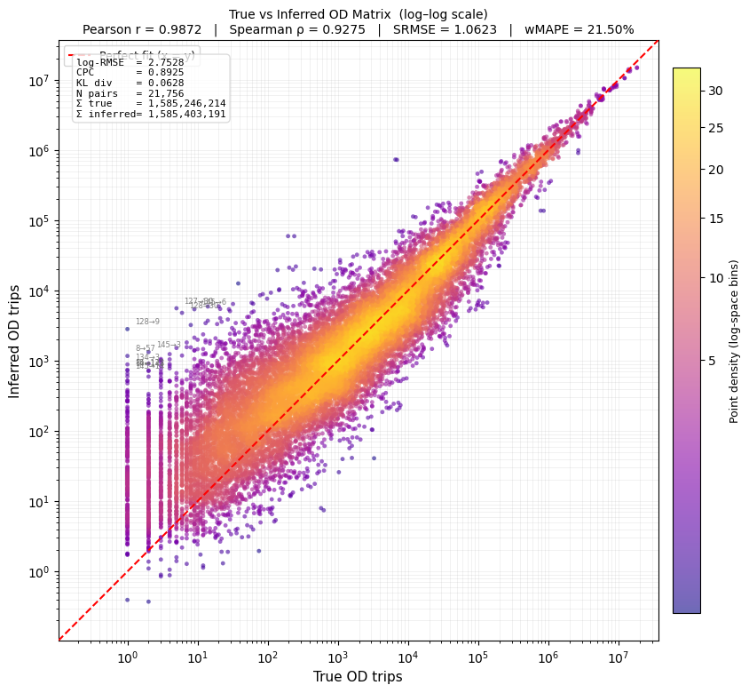{style="max-height: 550px;"}
:::

## Inference using logit paths effective distance (2022)
::: {style="text-align: center;"}
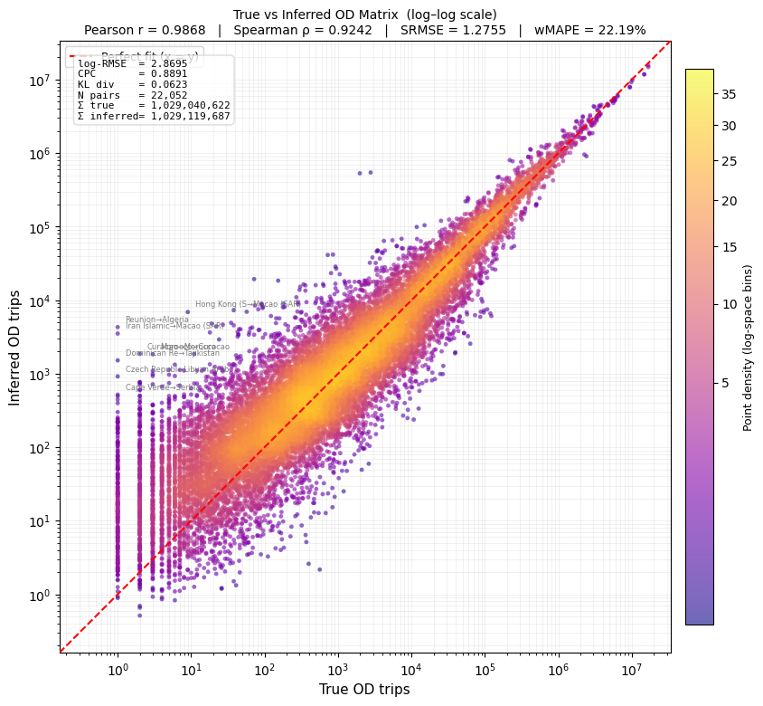{style="max-height: 550px;"}
:::

## US air travel network, 2025: State-level
::: {style="text-align: center;"}
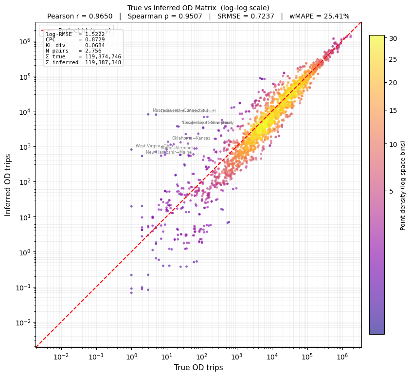{style="max-height: 550px;"}
:::

## US air travel network, 2025: Airport-level
::: {style="text-align: center;"}
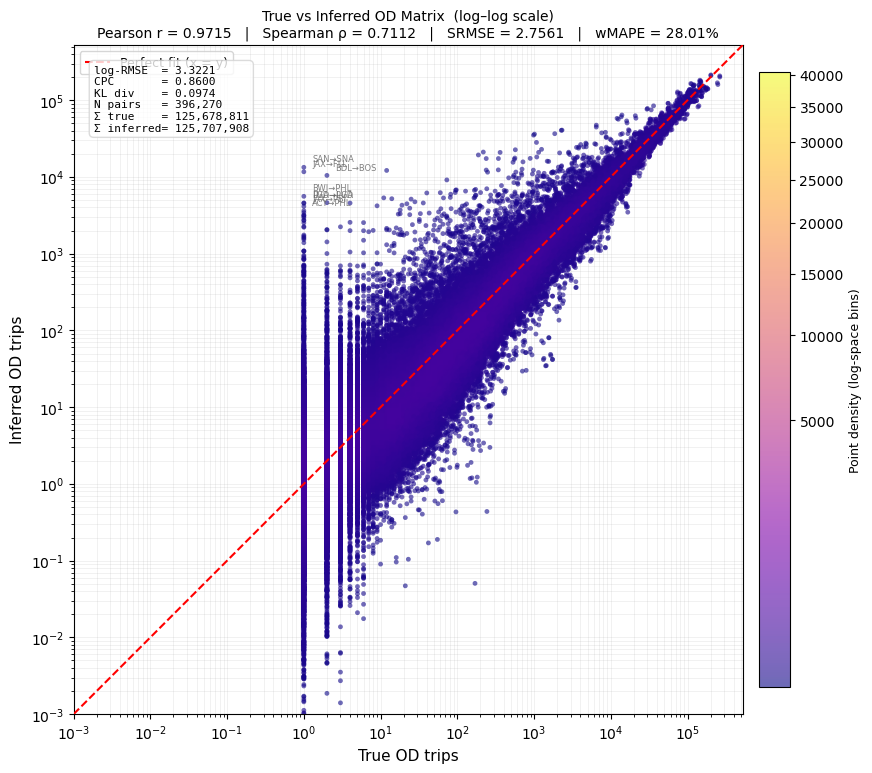{style="max-height: 550px;"}
:::

## Parameter Sensitivity Analysis
::: {style="text-align: center;"}
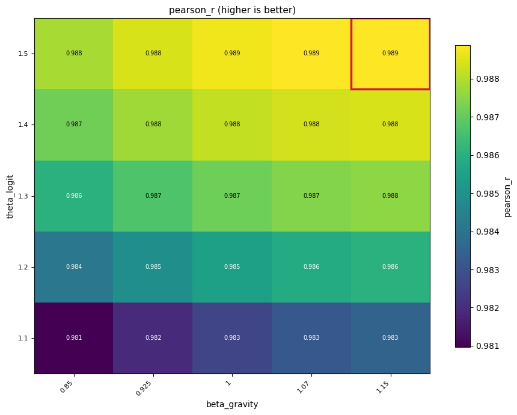{style="max-height: 550px;"}
:::

--- 

::: {style="text-align: center;"}
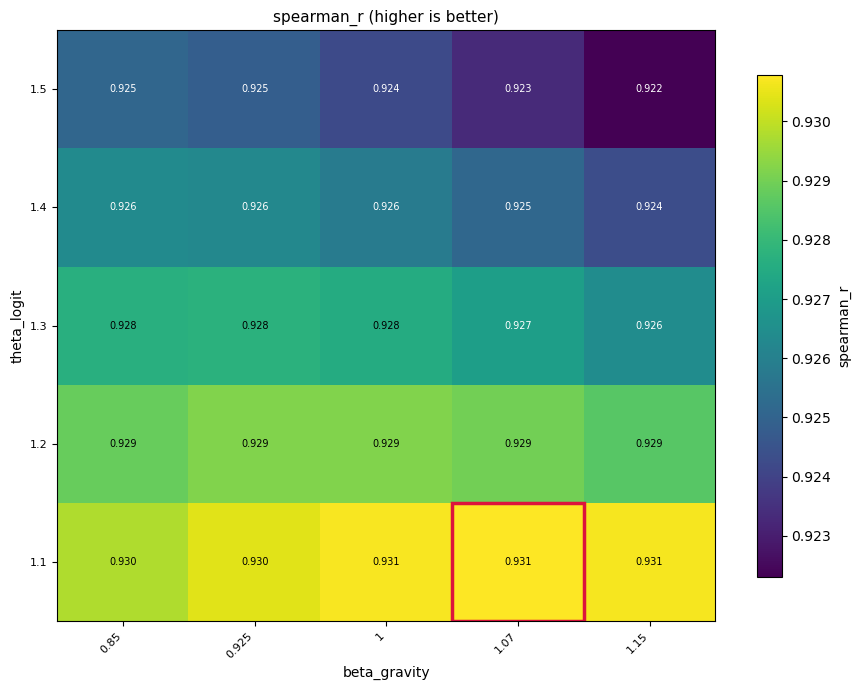{style="max-height: 550px;"}
:::

---

::: {style="text-align: center;"}
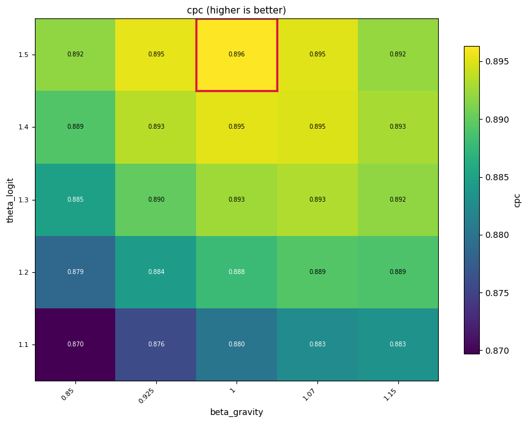{style="max-height: 550px;"}
:::

---

::: {style="text-align: center;"}
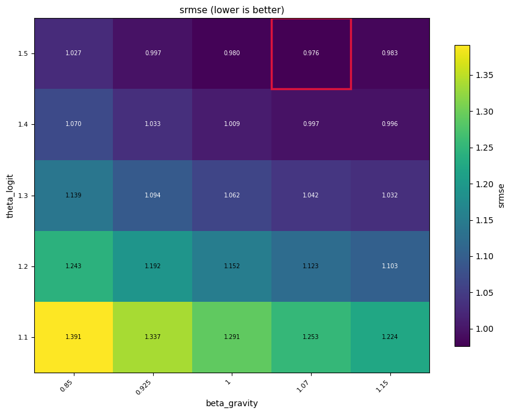{style="max-height: 550px;"}
:::

---

::: {style="text-align: center;"}
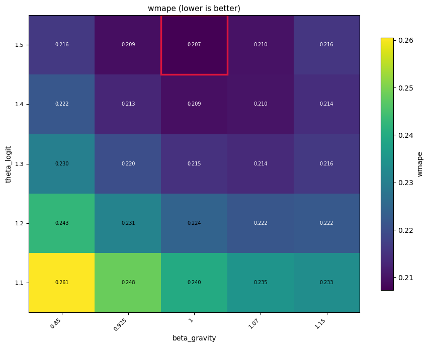{style="max-height: 550px;"}
:::

## Note: The Prior-Constraints Seesaw {.smaller}
- the new formulation of OD pair effective distance conveys information about alternative paths to the gravity model
- different regularization settings reveal this:
  - if regularization parameter $\sigma$ goes up (less trust in edge flow data), then
  - logit routing dispersion parameter $\eta$ goes down (allow more alternate paths)
  - gravity penalty parameter $\beta$ goes up (more trust in logit effective distance)
  - inference quality stays very similar after calibration, even though constraints are used less in optimization

## Reminder: intervention analysis {.smaller}
If I act to change the flow of edge a', how does this impact $T_{ij}$?

$$
\theta = (\lambda_1, \lambda_2, ... , \alpha_1, \alpha_2, ..., \beta_1, \beta_2, ...)
$$

$$
m_{ij} = \big(p^1_{ij}, \dots, p^E_{ij},\; \underbrace{0,\dots,1,\dots,0}_{i},\; \underbrace{0,\dots,1,\dots,0}_{j}\big)
$$

So: $\log T_{ij}^* = \log T_{ij}^0 - m_{ij}^T \theta$. If $V_a \rightarrow V_a + \delta V_a$, then the corresponding perturbation to the estimated trip matrix is 

$$
\delta \log T_{ij} = \delta \log \tilde T_{ij}^0 - \delta m_{ij}^T \cdot \theta -  m_{ij}^T \delta \theta
$$

## Perturbation Analysis Solution, In Full
::: {style="text-align: center;"}
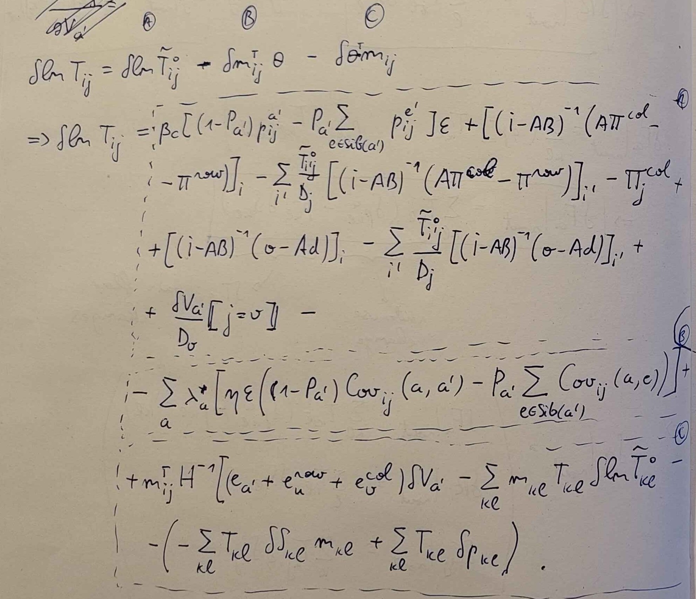{style="max-height: 550px;"}
:::

## Perturbation Analysis, Three Terms
$$
\delta \log T_{ij} = \delta \log \tilde T_{ij}^0 - \delta m_{ij}^T \cdot \theta -  m_{ij}^T \delta \theta
$$

- I: perturation of (balanced) gravity prior
- II: routing perturbation
- III: perturbation in optimizer response

## Scenario I - target OD pair, inspect edges {.smaller}
Suppose there is an outbreak in South Korea, and you are interested in knowing which edges are most impactful to perturb in order to limit the number of travellers coming from SK to Germany.

Make a list of candidate edges, then run the perturbation analysis:

- major origin out-edges (incl. with major hubs)
- major destination in-edges
- major transfer legs (e.g. ("Turkey", "Germany") )
- a few control edges

## Scenario I Results

::: {style="width: 100%; height: 600px; overflow-y: auto; border: 1px solid #ddd;"}
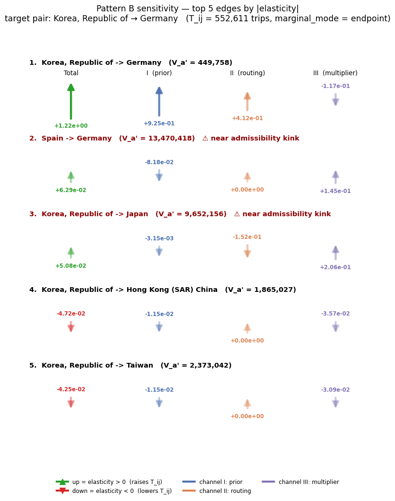{width="100%"}
:::

## Scenario I - only edges directly connected to Germany

::: {style="width: 100%; height: 600px; overflow-y: auto; border: 1px solid #ddd;"}
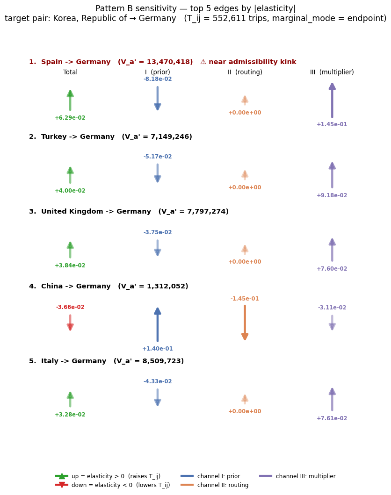{width="100%"}
:::

## Does the prediction hold for large perturbations?
If the flow on candidate edge is decreased by 50%, does the linear prediction of the perturbation to OD trips from SK to Germany agree with results of full re-inference?

I consider the 50% perturbation to top-20 largest in-edges of Germany, and the corresponding effect on OD trips from SK to Germany according to the two prediction approaches.

## Large perturbation - results
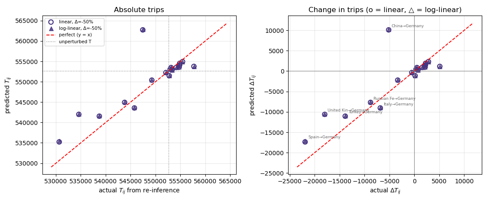

## Scenario II - target edge, inspect OD matrix
Suppose the edge USA -> Brazil is perturbed. Which OD pairs are most affected, and how?

## Scenario II - results
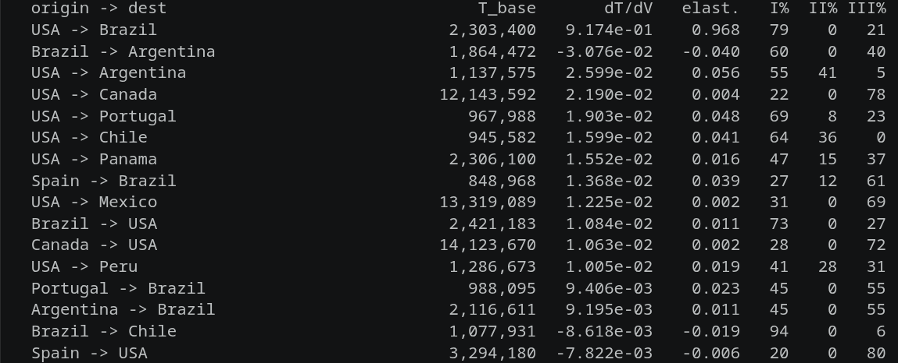

## Scenario II - large perturbations
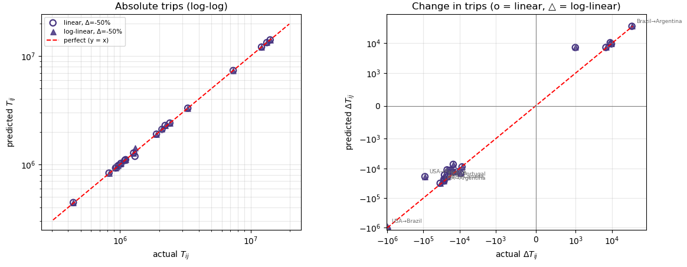

## One last idea: how does uncertainty propagate? {.smaller}

The perturbation analysis gives us the perturbation of the transport matrix $\frac{dT}{dV}$, as well as the perturbation of the OD effective distance $\frac{\partial d_{ij}}{\partial d_b} = p_{ij}^b$ . 

From this, it is possible to model

- the variance in est. of T, based on characteristics of noise on edge measurements
- the uncertainty in arrival time, based on characteristics of noise on edge measurements, since
 $$ t_{arrival}(i, j) \propto d_{ij}^{eff} $$

## Now:

- what is missing?

- what should be highlighted?