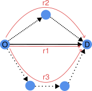
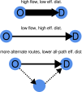
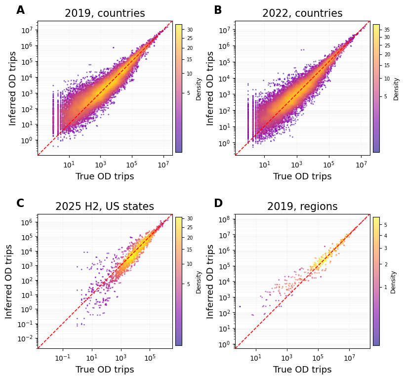
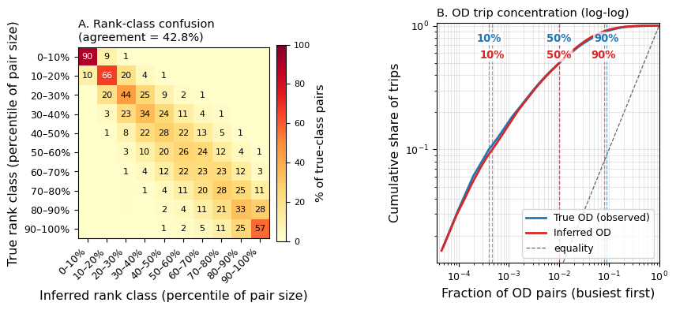
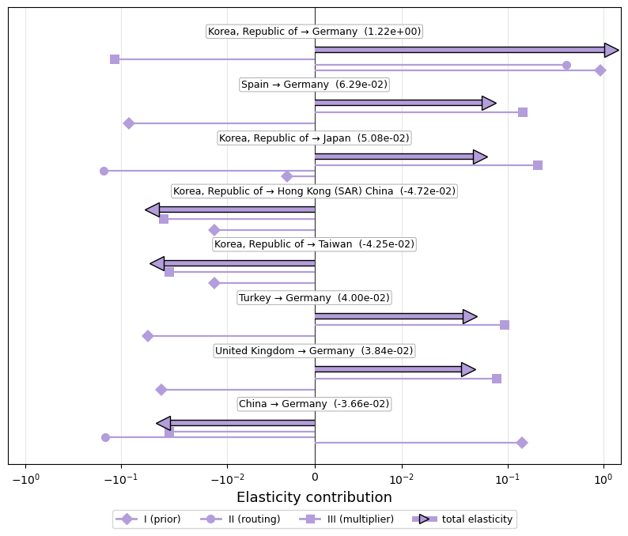
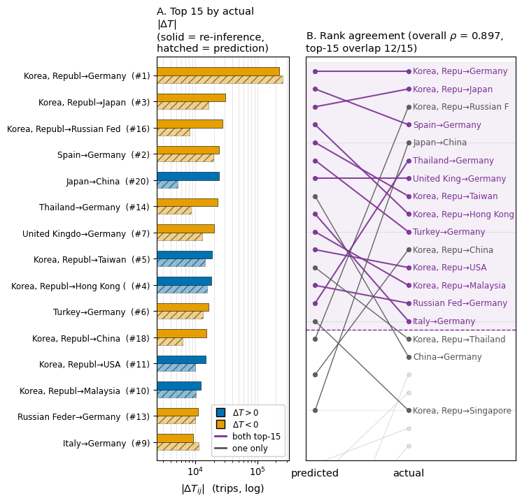
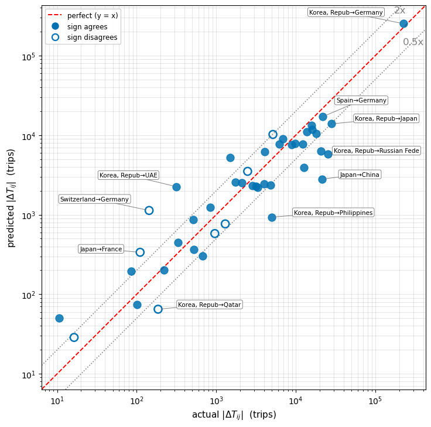
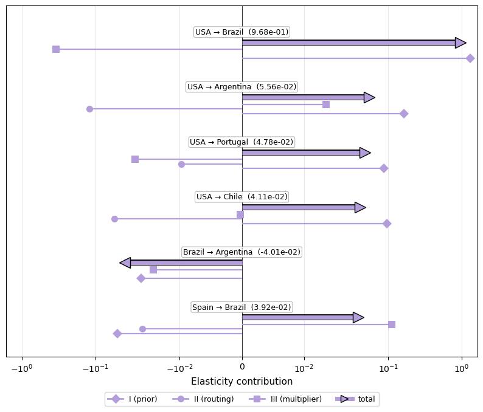
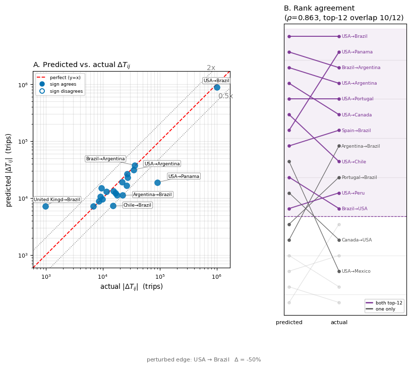
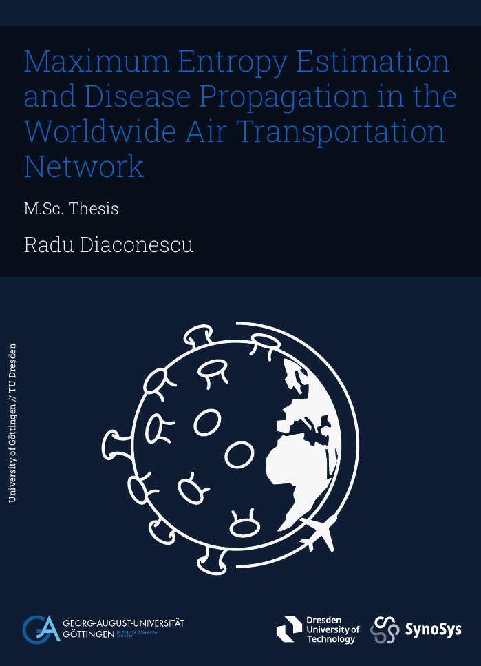

# Context

## Motivation {.scrollable}

- The fastest avenue to spread infectious diseases around the world is through the world aviation network.

- To understand disease propagation from A to B, the important piece of information is: how many trips occur between origin A and destination B, regardless of paths taken? -\> **Origin-Destination Matrix**.

- Problem: data typically contains direct passenger flows, not overall OD trips.

  <video autoplay loop muted playsinline width="70%">
    <source src="videos/network_animation.webm" type="video/webm">
  </video>

## Goals

- **Starting point**: known transport network topology (e.g. nodes = countries, links = direct flight connections), known fluxes on all links.

- Goal I: based on flux data, infer the most likely origin-destination matrix for the network.

- Goal II: understand how the perturbation of an edge's flux affects global OD patterns.

# Goal I: Inferring the OD matrix

## Route Choice

Logit route choice model:

$$ \pi_r = \frac{e^{- \eta c_r}}{\sum_{s \in \mathcal{R}_{ij}} e^{- \eta c_s}} $$

::::: columns
::: {.column width="50%"}
{height="350px" fig-align="center"}
:::

::: {.column width="50%"}
{height="350px" fig-align="center"}
:::
:::::

## Network Distance

::::: columns
::: {.column width="50%"}
Effective distance: $$d_{i j}^{\operatorname{eff}} = d_0 - \ln (P_{i \rightarrow j})$$ 

<!-- [[**(Higher passenger flux -\> lower eff. distance)**]{.underline}]{style="font-size: 0.62em;"} -->

All-path effective distance: $$d_{i j}^{A} = - \frac{1}{\eta} \ln \left( \sum_{r \in \mathcal{R}_{i j}} e^{- \eta d_r^{\operatorname{eff}}} \right) $$
:::

::: {.column width="50%"}
\

{height="470px" fig-align="right"}

:::
:::::

## Gravity Model

The number of trips from O to D is:

- proportional to the populations of O and D
- penalized by a deterrence function of distance

::::: columns
::: {.column width="50%"}
$$T^0_{O D} \propto \frac{N_O N_D}{f(d_{O D})}$$
:::

::: {.column width="50%"}
\[figures here\]
:::
:::::

## Maximum Entropy

**Core idea**: best estimate makes no assumptions save for known data ⟺ maximizes informational entropy under constraints.

Inference problem becomes a constrained **optimization** problem:

find OD matrix $T$ where $\left( - \sum_{i j} T_{i j} \ln \left( \frac{T_{i j}}{T^0_{i j}}\right) - T_{i j} + T^0_{i j} \right)$ is maximized under constraint that $F_a - \sum_{i j}p_{i j}^a T_{i j} = 0$.

[$T$ is the OD matrix, $T^0$ the gravity prior. $F_a$ = flow on edge a. $p_{i j}^a$ is the proportion of trips from origin i to destination j that use edge a.]{style="font-size: 0.7em;"}

## Inference Results {.scrollable}

::::: columns
::: {.column width="65%"}
{height="600px" fig-align="left"}
:::

::: {.column .small-col width="35%"}
- strong performance on measures of correlation\
  **(r = 0.96-0.99,** $\rho$ **= 0.92-0.97)** and of correct distribution of ODtrips **(cpc = 0.87-0.94, KL Div = 0.06)**
- some prediction error persists, scaling inversely with OD pair size **(wMAPE = 11-25%, SRMSE = 0.26-1.27)**
:::
:::::

{fig-align="center" width=100%}

# Goal II: Perturbation Analysis

## Two perturbation questions
1. Given an outbreak at node A, how does a policymaker effectively prevent (infected) passengers from travelling to node B? $\rightarrow$ Which edges are most influential for a given OD pair?

2. If an edge in the transportation network is perturbed, which OD pairs are most affected?

Idea: if the MaxEnt solution represents the best estimate of the OD matrix, then analyzing how the estimate shifts with passenger flow perturbations may provide the best clue for how the OD matrix shifts.

## Linear perturbation analysis

Given a perturbation $\delta V_a$ of the flow $V_a$ on edge $a$, it can be shown that 

::: {style="text-align: center;"}
$$
\small
\boxed{
\delta \ln T_{ij} = \underbrace{\delta \ln \tilde{T}^0_{ij}}_{\scriptsize\text{I. prior perturbation}} - \underbrace{\delta m_{ij}^T \theta}_{\scriptsize\text{II. routing perturbation}} - \underbrace{m_{ij}^T \delta\theta}_{\scriptsize\text{III. multiplier perturbation}}
}
$$
:::

Note: reinterpreting $\delta V_a = \epsilon _a$ as passenger flow measurement error (vector of errors $\epsilon$), and $j_{i j} = \nabla T_{i j}$, this same approach gives the variance of the estimated OD matrix as $\operatorname{Var}(T_{i j}) = j_{i j}^T \operatorname{Cov}(\epsilon)j_{i j}$. 

## Scenario I Results {.scrollable}

If there is an outbreak in South Korea, which edges should decrease their flows to prevent passengers from travelling to Germany?

{fig-align="center" height=100%}

Does linear prediction agree with full re-inference for a large perturbation (50%)?

{fig-align="center" height=100%}

{fig-align="center" height=100%}

## Scenario II Results {.scrollable}

If the edge USA $\rightarrow$ Brazil is perturbed, which OD pairs are most affected?

{fig-align="center" height=100%}

Does linear prediction agree with full re-inference for a large perturbation (50%)?

{fig-align="center" height=100%}

# Conclusion {.scrollable}
- The technique of maximum entropy with constraints can estimate origin-destination travel patterns from edge flows efficiently. 
- A linear perturbation analysis can indicate which edges are most influential for origin-destination pairs of interest. 
- These tools can be useful in epidemiology, as well as having broader applicability in transport networks.

Full details and bibliography:

  

